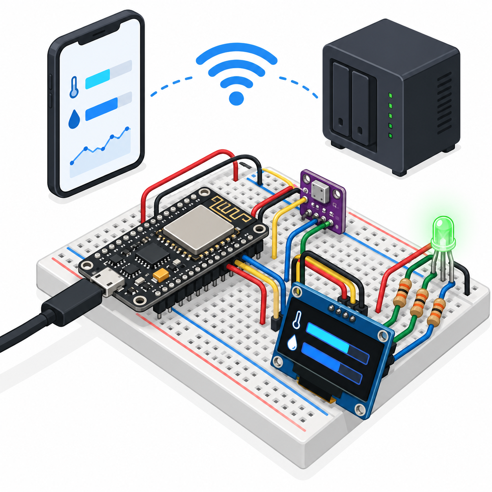

# Smart Entryway Usage Analytics
An ESP8266 NodeMCU displays BME280 temperature/humidity, drives an RGB indicator, and measures **actual enabled-indicator time** in hourly and daily buckets. Matter control is provided through an explicit Home Assistant/Matterbridge bridge, not a native ESP8266 Matter implementation.



## Overview, objectives and features
Learn interval attribution, ring-buffer summaries and time rollover. USB/MQTT ON/OFF requests indicator enable. Valid readings drive red at humidity≥70%, blue below15°C, otherwise green. Invalid sensor data blanks RGB and is not counted. OLED shows readings, request/actual state, current-day minutes and seven-day-slot minutes.

## Architecture and platform
NodeMCU nodemcuv2 Arduino, real BME280/SSD1306 drivers and PubSubClient. [Usage counter](firmware/usage.h) maintains24hour and7day buckets. [Architecture](docs/architecture.md). MQTT→HA entity→Matterbridge-hass→Matter controller is the interoperability path. Counters and physical display work locally over USB without the bridge.

## BOM quantities
| Qty | Item |
|---:|---|
| 1 | ESP8266 NodeMCU and USB data/power cable |
| 1 | BME280 I2C breakout0x76 supporting3.3V |
| 1 | SSD1306 I2C128×64 OLED0x3C supporting3.3V |
| 1 | Common-cathode RGB LED |
| 3 | 330Ω resistors |
| 1 each | Breadboard and jumper set |
| 1 each for Matter | MQTT broker, HA instance, Matterbridge host and Matter controller |

## Prerequisites and exact pin map
Python3.12, PlatformIO6.1.18 and USB serial driver. All sensor pullups and GPIO must be3.3V.
| NodeMCU | Connection |
|---|---|
| D2/GPIO4 | Both SDA |
| D1/GPIO5 | Both SCL |
| D6/GPIO12 | 330Ω→red anode |
| D7/GPIO13 | 330Ω→green anode |
| D5/GPIO14 | 330Ω→blue anode |
| 3V3 | BME/OLED VCC and BME CSB |
| GND | BME/OLED GND, BME SDO, RGB common cathode |

## Circuit/wiring and assembly
Disconnect USB; follow [editable circuit](docs/circuit-diagram.svg) and [wiring](docs/wiring.md). Connect sharedI2C, inspect addresses and LED pinout. Each color needs a separate resistor. Avoid5V I2C pullups. Verify BME model (BMP280 lacks humidity) and set SDO low for0x76 before power.

## Setup and flashing
```sh
python -m pip install platformio==6.1.18
pio run -e nodemcuv2
pio run -e nodemcuv2 -t upload
pio device monitor -b 115200
```
[Source](firmware/smart-entryway-usage-analytics/smart-entryway-usage-analytics.ino). Default Wi-Fi/MQTT strings are blank; USB ON/OFF works independently. For network operation create ignored firmware/config.private.h with WIFI_SSID,WIFI_PASSWORD,MQTT_HOST,MQTT_USER,MQTT_PASSWORD defines, then rebuild privately. Never commit credentials.

## Configuration and Matter setup
Use port1883 only on an isolated lab network; secure transport is future work. Configure the HA MQTT integration with your broker. Merge [HA YAML](config/home-assistant.yaml) into existing configuration and restart/reload the integration. Confirm switch.entryway17_indicator exists (adjust entity ID to actual HA discovery naming). Install the official Matterbridge HA Application or standalone Matterbridge and the [matterbridge-hass plugin](https://github.com/Luligu/matterbridge-hass). Configure its HA host and private HA access token **outside Git**, create a filter label, apply it to the Entryway17 switch and temperature/humidity sensors, restart and verify the exported devices, then pair Matterbridge’s QR code with the controller. The plugin explicitly supports HA switches and environmental sensors. This bridge setup and pairing are documented but have not been executed here.

## Usage, telemetry/data formats and expected output
Send newline-terminated ON/OFF at115200, publish exact non-retained ON/OFF to entry17/command, or toggle the bridged switch. entry17/switch/state reflects the **request**, while JSON active reflects physical indicator eligibility. Actual LED hardware behavior is untested. Retained entry17/state and USB JSON contain id17, uptime_s, valid, temperature_c, humidity_pct, requested, active, hour_ms, day_ms, slots24_ms, slots7day_ms. [Sample](sample-data/telemetry.jsonl). Invalid values use0 placeholders with valid=false; do not interpret them as measurements. LWT/birth entry17/status is offline/online; commands are best-effortQoS0.
After one valid enabled minute, day_ms increases approximately60000; after OFF it stops. The previous sampled state is attributed to each elapsed interval (1s sampling uncertainty). OLED day/week values are integer minutes.

## Time model and limitations
“Day” is an86400000ms interval since first sampling after reboot, not a calendar day. The24hour summary contains current and23previous hourly slots; the7day summary contains current and6previous day slots. Boundary eviction is exact but summaries are coarse buckets, not exact sliding24h/168h windows. Counts are RAM-only and reset on reboot. millis wrap is extended through periodic samples; a sampling gap≥49.7days is unsupported. This measures indicator enabled time, not occupancy, lamp energy, household usage or calibrated comfort. OLED failure does not diagnose sensor health.

## Actual run tests
[Run results](docs/validation-results.md) record meaningful C++ counter tests,3image tests, artifact/credential checks and actual NodeMCU compilation. [Test plan](docs/test-plan.md). Hardware calibration, MQTT/HA networking and Matter pairing have not been tested.
```sh
g++ -std=c++17 tests/usage_test.cpp -o /tmp/usage
/tmp/usage
python -m unittest discover -s tests
python tools/validate.py
python tools/validate_completion.py
```

## Troubleshooting
No readings: verify BME0x76 and3.3V wiring. OLED blank: verify SSD1306 dimensions/address0x3C. Counter not increasing: requestedON and valid must both be true. Wrong colors: common cathode/anode mapping. Matter missing: confirm HA switch first, plugin filter labels, HA token/host and bridge pairing; ESP8266 itself does not advertise Matter.

## Domain safety
Low voltage indicator only; never connect mains, locks or critical equipment. Keep3.3V GPIO isolated from5V. Environmental thresholds are demonstration values, not health warnings. Restrict the unencrypted lab MQTT network and keep tokens/passwords out of commits.

## Future work
Add authenticated telemetry, calibrated sensors, qualified flash persistence and real calendar timestamps. Verify bridge interoperability on physical controllers.

## Contributing and license
Keep counter boundary/rollover coverage and pin-map consistency; distinguish mock data from measured data. Full [MIT license](LICENSE).
